# CUARTA SEMANA  

---

## • DOM XSS  
**Categorización:**  Injection
**CWE:**  79

- En este reto se presupone que hay que atacar al DOM mediante inyección.  
- Introducimos en el campo de búsqueda una sentencia HTML con código JavaScript para que se inyecte.  

- Al enviar la búsqueda, salta una alerta en el navegador.  
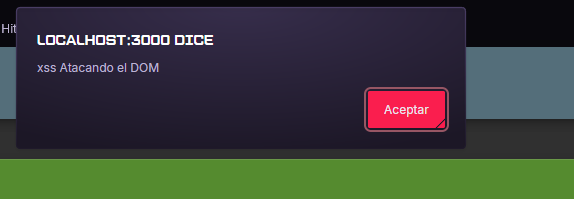
- El reto se resuelve cuando se ejecuta el script.  
- Se utilizaron las ayudas porque inicialmente no se tuvo en cuenta que el payload debía usar `` ` `` en lugar de `'`.  
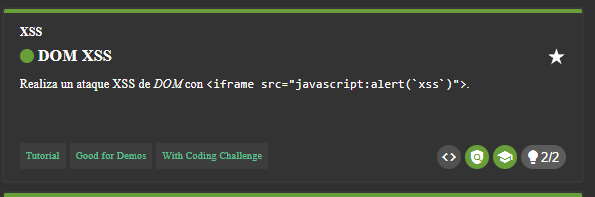

---

## • Bonus Payload  
**Categorización:**  Injection
**CWE:**  79

- Este reto consiste en algo similar al anterior.  
- Debemos copiar el `iframe` que proporciona Juice Shop en el campo de búsqueda.  
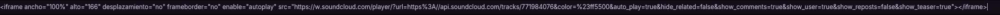
- Al ejecutarlo, se carga un audio en la página.  
- Con ello, el reto queda resuelto.  
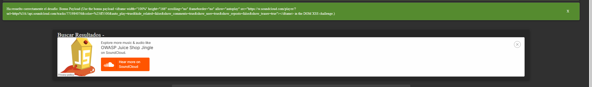

---

## • Login Admin  
**Categorización:**  Injection
**CWE:**  89
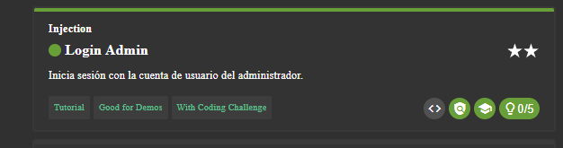
- Este reto ya se resolvió previamente al realizar el ataque de fuerza bruta.  
- La contraseña encontrada fue `admin123`.  
- También fue necesario iniciar sesión como administrador para completar otros retos.  

---

## • Login Jim  
**Categorización:**  Injection
**CWE:**  89

- Primero averiguamos el correo de Jim, que aparece en la reseña del jugo verde (ya conocido de retos anteriores).  

- Intentamos iniciar sesión con cualquier contraseña añadiendo al correo `'--`.  
- De esta forma, la comprobación de contraseña se omite mediante inyección SQL.  
- Se accede a la cuenta y el reto queda completado.  
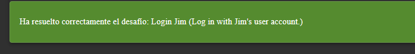

---

## • Login Bender  
**Categorización:**  Injection
**CWE:**  89

- Es similar al reto anterior.  
- Obtenemos el correo de Bender buscándolo en las reseñas. 
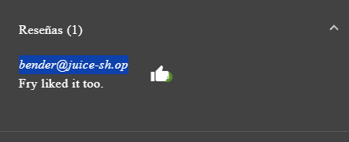 
- Intentamos iniciar sesión con `bender@juice-sh.op'--` y cualquier contraseña.  
- Se logra el acceso y se completa el reto.  
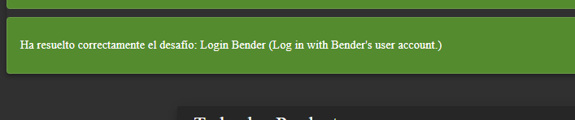

---

## • Database Schema  
**Categorización:**  Injection
**CWE:**  89

- Para realizar la inyección SQL, primero debemos identificar qué tipo de base de datos utiliza la aplicación.  
- Utilizamos **Burp Suite** para interceptar la petición que carga los productos.  
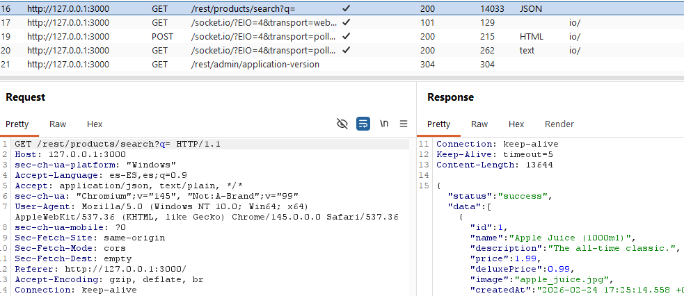
- Enviamos la petición al **Repeater** y probamos con una entrada como `banana'`.  
- El error devuelto permite identificar que la base de datos es **SQLite**.  
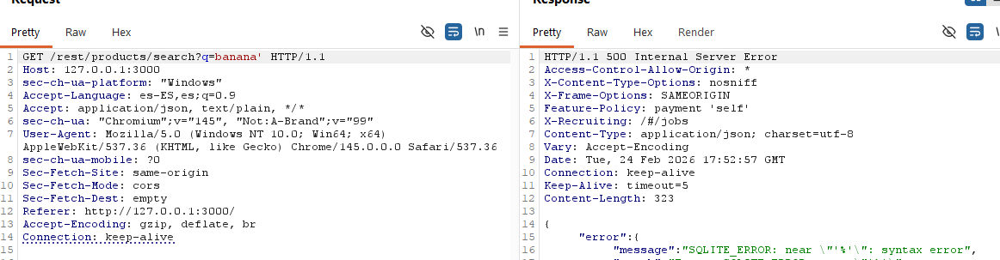
- Visitamos la documentación oficial de SQLite para revisar su sintaxis.  
- Para resolver el reto, realizamos una inyección `UNION SELECT` en la petición GET para listar todas las tablas de la base de datos.  
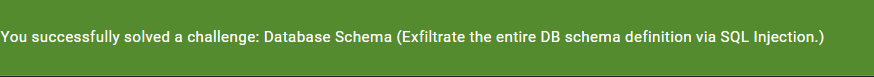
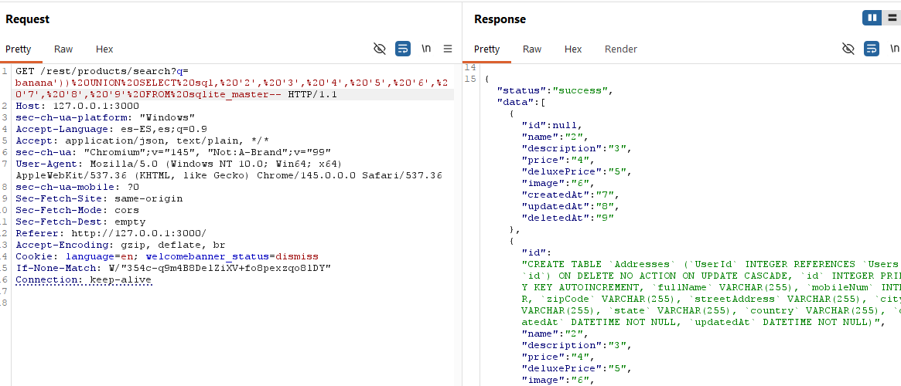

---

## • User Credentials  
**Categorización:**  Cryptographic Failures
**CWE:**  522

- Para resolver este reto es recomendable haber completado el anterior, ya que necesitamos conocer los nombres de las tablas y columnas.  
- Requiere conocimientos de ataque `UNION SELECT`.  
- Con **Burp Suite** interceptamos la URL utilizada anteriormente.  
- Modificamos la consulta para acceder a la tabla `Users`.  
- Seleccionamos columnas como `email` y `password` para simular la extracción de credenciales.  
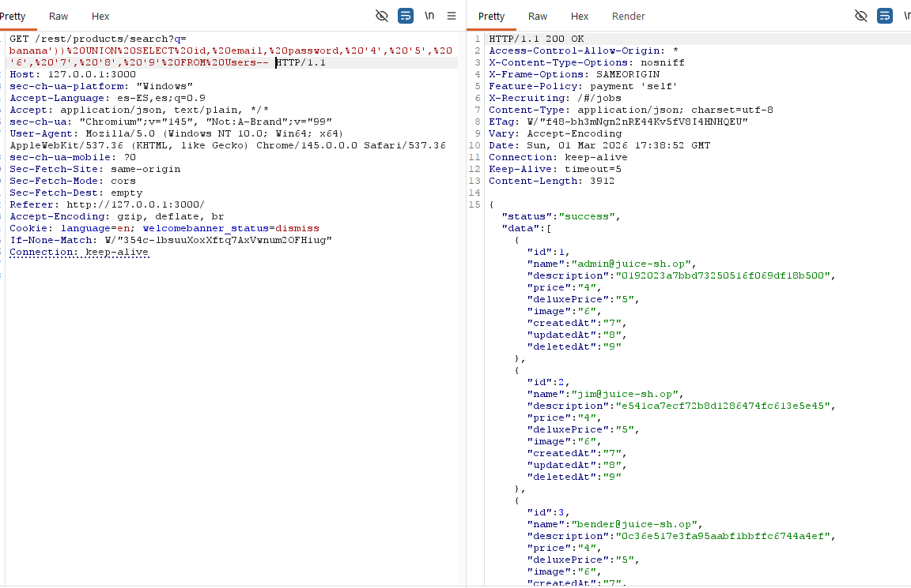
- Con ello, el reto se completa.  

---

## • View Basket  
**Categorización:**  Broken Access Control
**CWE:**  639

- Iniciamos sesión con un usuario (por ejemplo, nuestra cuenta).  
- Añadimos productos a la cesta.  
- Inspeccionamos en **Application → Storage** y observamos variables como el precio y el `bid`.  
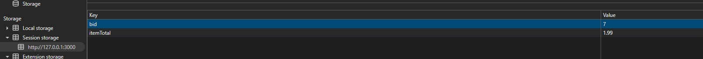
- `bid` hace referencia al identificador de la cesta.  
- Si modificamos este parámetro, podríamos acceder al carrito de otro usuario.  
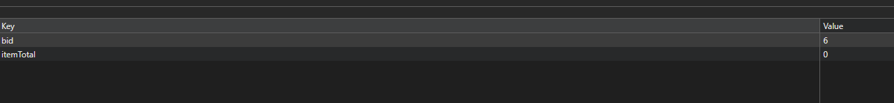
- Al recargar la página tras modificarlo, aparece la cesta de otro usuario y se completa el reto.  
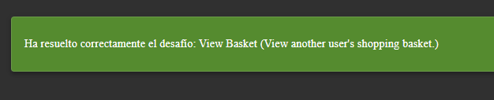

---

## • Admin Section  
**Categorización:**  Broken Access Control
**CWE:**  285

- Este reto se resolvió accidentalmente en otro desafío.  
- Siguiendo la lógica de endpoints como `/score-board`, se probó acceder a `/administration`.  
- Se logró acceder al panel de administración.  
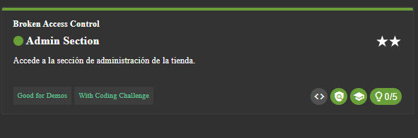

---

## • Forged Feedback  
**Categorización:**  Injection
**CWE:**  89

- Accedemos al formulario de contacto.  
- Por defecto, cada reseña se asocia al usuario autenticado.  
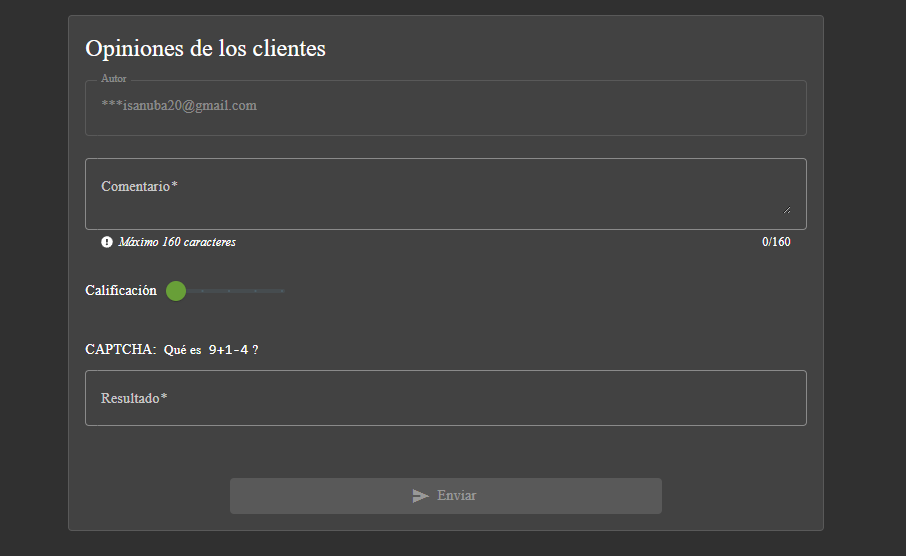
- Inspeccionamos el HTML del formulario.  
- Encontramos un campo oculto (`hidden`) que guarda el ID del usuario.  
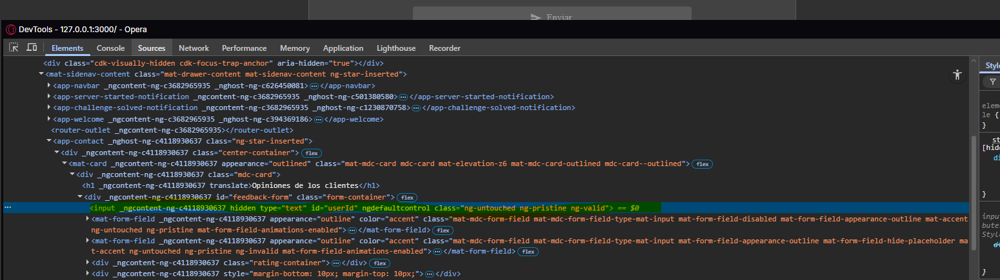
- Eliminamos el atributo `hidden` para poder modificar el valor.  
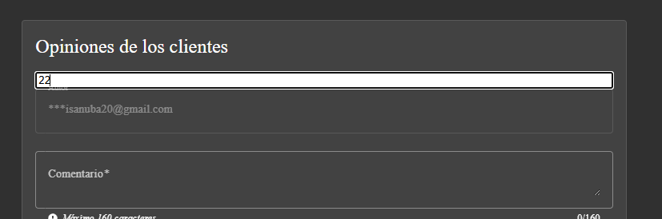
- Introducimos el ID de otro usuario.  
- Se crea una reseña en nombre de otro usuario y se completa el reto.  
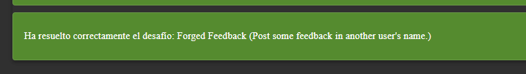

---

## • Manipulate Basket  
**Categorización:**  Broken Access Control
**CWE:**  639

- Similar al reto **View Basket**.  
- Al añadir un producto, inspeccionamos y localizamos el ID de nuestra cesta.  
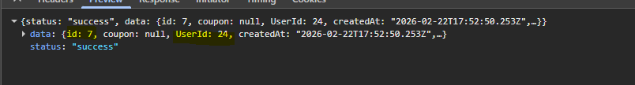
- Obtenemos el token desde **DevTools** y lo introducimos en **Postman** para poder autenticar la petición.  
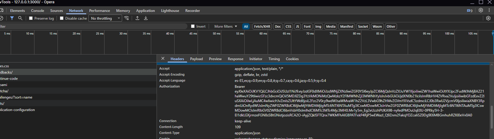
- Realizamos una petición POST añadiendo un producto, duplicando el ID de usuario (el nuestro y el de otro usuario).  
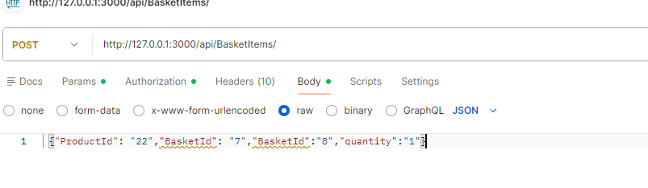
- Al ejecutarlo, el producto se añade al carrito con ID 8.  
- De esta forma, el reto se completa.  
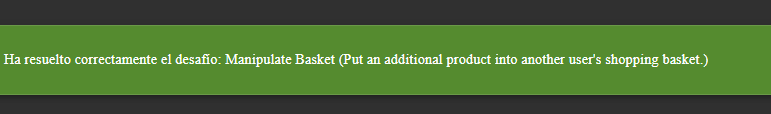

---