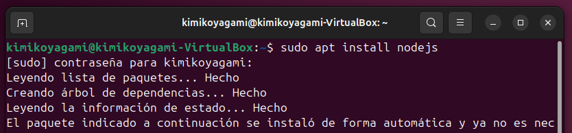
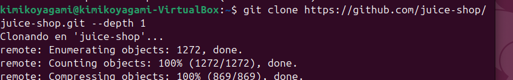
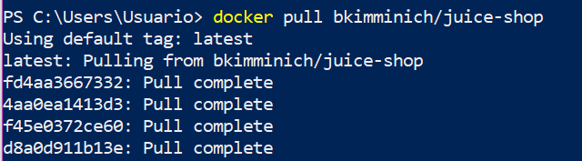
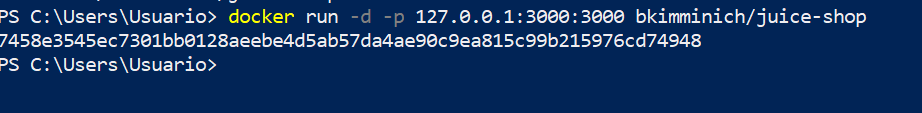
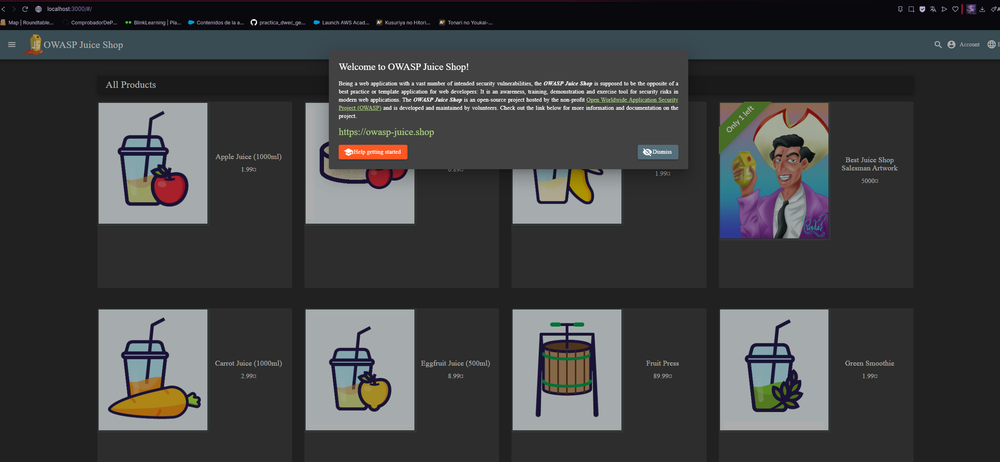
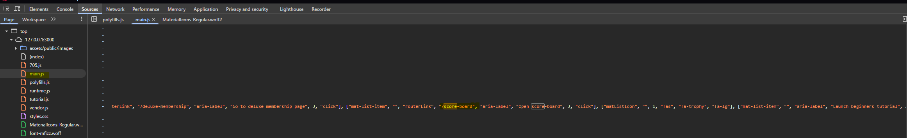
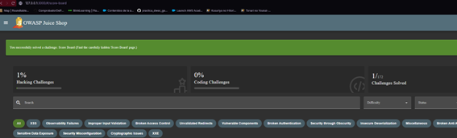

# Instalación de OWASP Juice Shop

## 1. Instalación con Node.js

1.  Instalamos Node.js.\
    En mi caso, usaré una máquina virtual con **Ubuntu 24.04**.


2.  Clonamos el repositorio:

``` bash
git clone https://github.com/juice-shop/juice-shop.git --depth 1
```


3.  Nos movemos a la carpeta `juice-shop` y ejecutamos:

``` bash
npm install
```

Como da problemas de dependencias y no detecta correctamente la versión
de Node, se prueba en el propio ordenador usando Docker.

------------------------------------------------------------------------

## 2. Instalación con Docker

4.  Ejecutamos el siguiente comando:

``` bash
docker run -d -p 127.0.0.1:3000:3000 bkimminich/juice-shop
```



5.  Abrimos el navegador y cargamos:

http://localhost:3000



------------------------------------------------------------------------

# Primer reto

-   Examinamos el código JavaScript de la aplicación web.
-   En la pestaña **Source**, podemos buscar por palabras clave (por
    ejemplo: `score`).
-   Encontramos una línea donde se declaran constantes que nos llevan a
    rutas URL de la web.
    
-   Si accedemos a /score-board ,resolveremos el panel de puntos.


------------------------------------------------------------------------


