# CONTINUACIÓN – CUARTA SEMANA  

---

## • Confidential Document  
**Categorización:** Broken Access Control
**CWE:** 284

- Para realizar este reto, debemos acceder a la página **“Sobre nosotros”** y pulsar el enlace indicado en la descripción.  
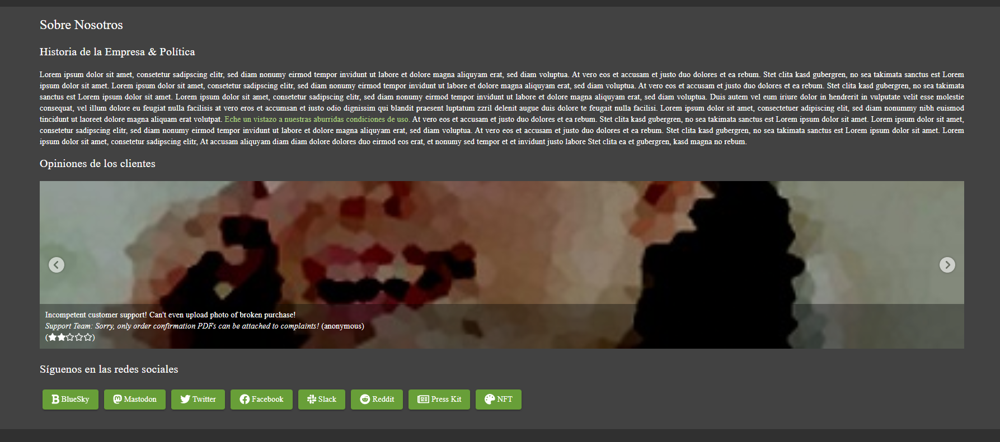
- Esto nos redirige a un servidor **FTP** con acceso a un archivo concreto.  
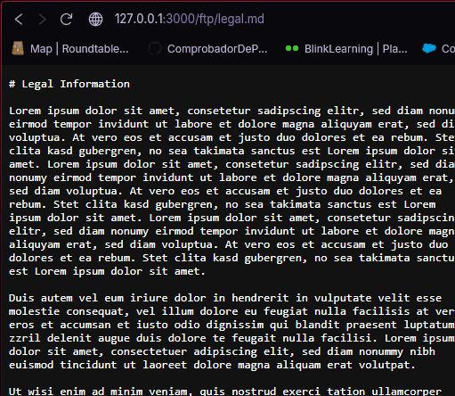
- Si editamos la URL y eliminamos el nombre del archivo específico, podremos acceder al directorio del FTP.  
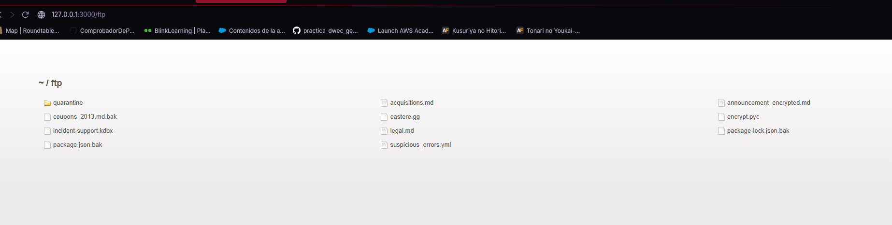
- Una vez dentro, accedemos al archivo `acquisitions.md`.  
- Al visualizarlo, el reto queda resuelto.  
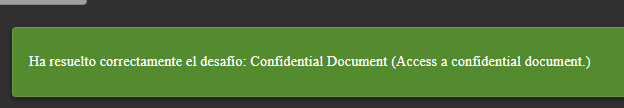

---

## • Exposed Metrics  

*No existe en la versión de Docker*  

---

## • Login Amy  
**Categorización:** Injection
**CWE:** 89
- Para resolver este reto debemos fijarnos en dos pistas de la descripción:  
  - El personaje hace referencia a **Futurama**.  
  - Se menciona a su esposo **Kif**.  
  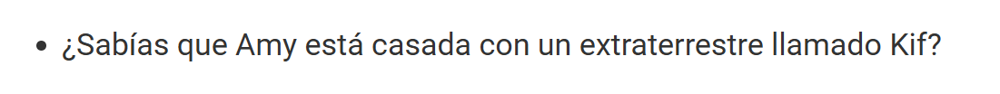

- También se menciona la frase “una aguja en un pajar” (needle in a haystack).  
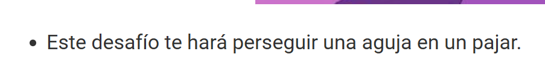
- Buscamos en Google:  
- How easy is my Haystack password?
- Accedemos a la página: https://www.grc.com/haystack.htm  
- Bajamos hasta ver un ejemplo como `d0g.....`.  
- Sustituimos “dog” por `k1f.....` siguiendo el mismo patrón. 
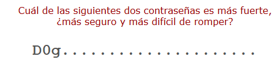 
- Probamos la contraseña generada.  
- El usuario puede visualizarse desde la vista de administrador.  
- Con esto, el reto queda resuelto.  
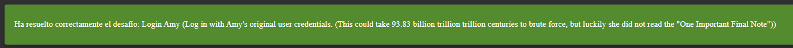

---

## • Access Log  

*No existe en la versión de Docker*  

---

## • Forgotten Developer Backup  
**Categorización:** Cryptographic Failures
**CWE:** 312
- Para este reto necesitamos conocer el concepto de **null byte poisoning**.  
- Accedemos al FTP e intentamos abrir el archivo `package.json.bak`, pero devuelve un error.  
- Aplicamos la técnica de *null byte poisoning*.  
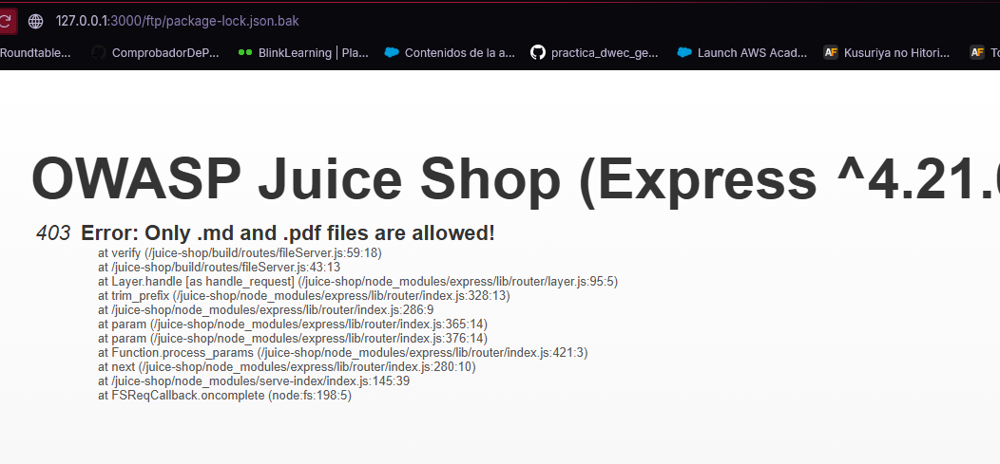

- Al final de la URL añadimos:  %00.md
- Esto genera otro error.  

- Para solucionarlo, añadimos `25` delante de `00`, quedando algo como:  %2500.md
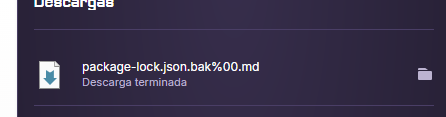
- Con esto logramos acceder y descargar el archivo `.md`.  
- El reto queda resuelto (y también el de **Poison Null Byte** si no estaba completado).  
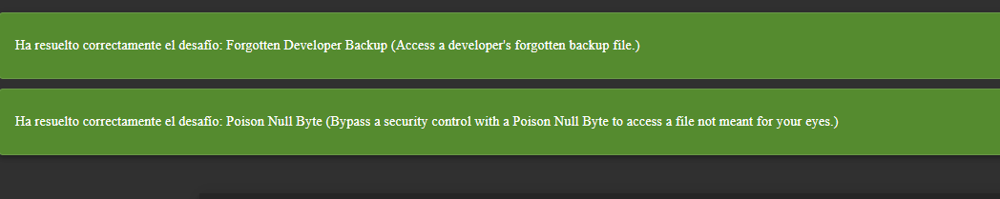

---

## • CAPTCHA Bypass  
**Categorización:** Security Misconfiguration
**CWE:** 693
- Para resolver este reto utilizamos la consola del navegador y el apartado **Network** de DevTools.  
- Observamos que se realiza una petición POST a: api/feedback
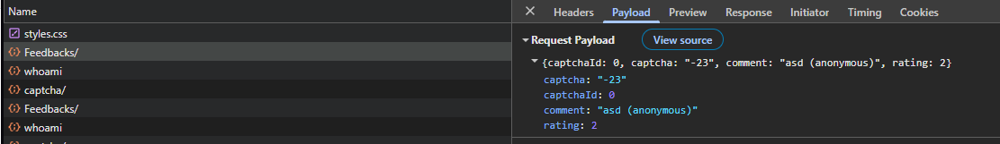
 - Creamos un pequeño script con un bucle `for` que envíe múltiples peticiones (por ejemplo, 10).  
 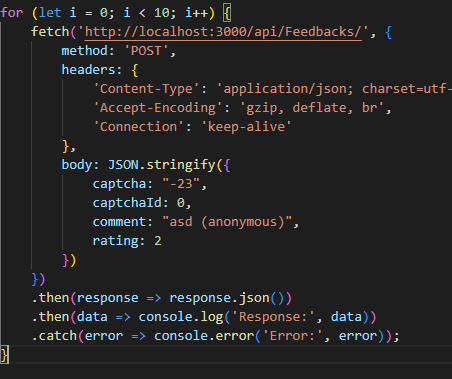
- Ejecutamos el script desde la consola.  
- Al enviarse múltiples solicitudes automáticamente, se completa el reto. 
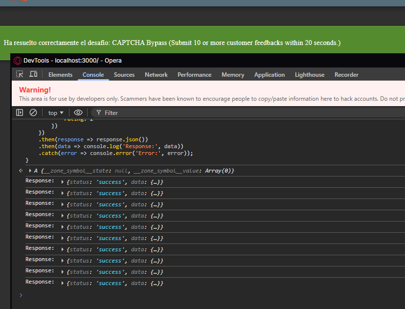 

---