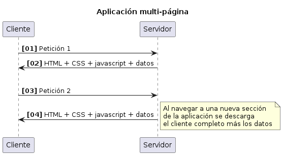
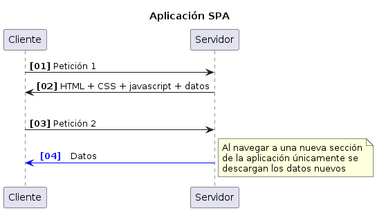
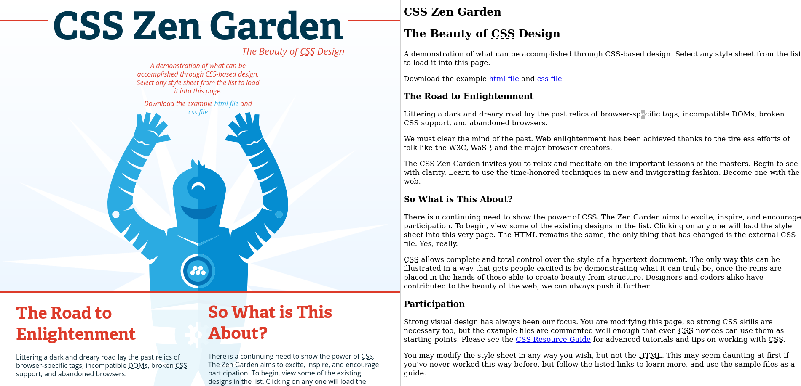
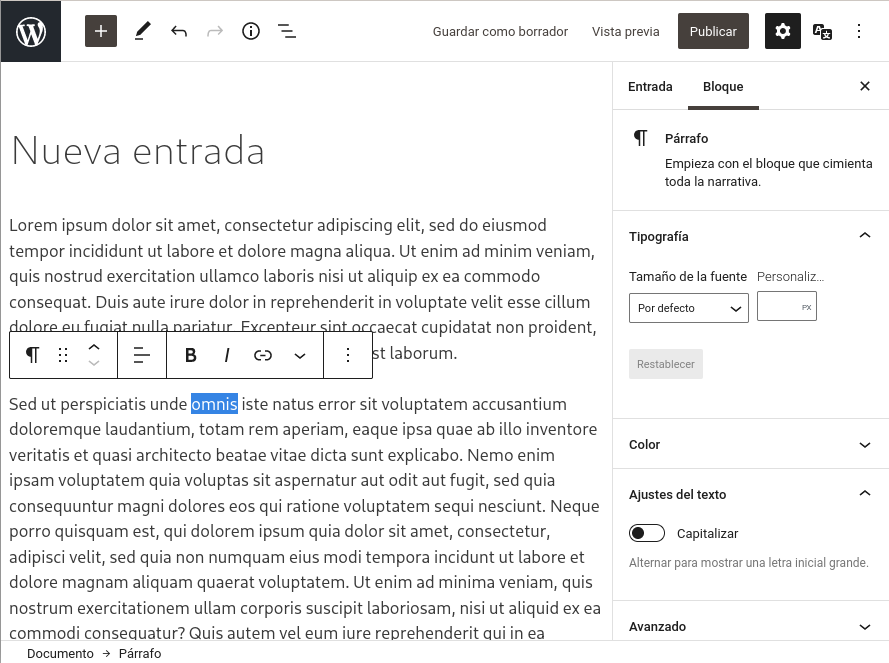
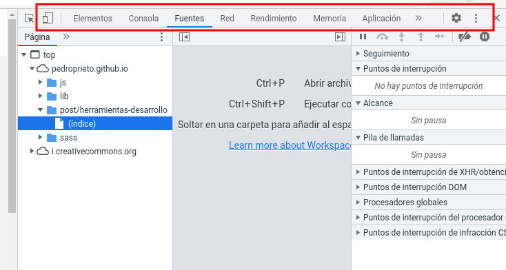

* Temporalización
Esta práctica ocupará *varias semanas* de clase. El *objetivo* es conocer las *vulnerabilidades web más habituales* y los *mecanismos de protección* correspondientes para corregirlas o minimizarlas.

* Tareas
- Lee la teoría incluida en el repositorio
- Lee la documentación disponible en los enlaces sobre HTTP, si no lo has hecho aún
- Instala la aplicación OWASP Juice Shop en AWS (las instrucciones están en la última sección de este documento)
- Lee con atención los siguientes apartados de la [[https://pwning.owasp-juice.shop/companion-guide/latest/index.html][documentación de OWASP Juice Shop]]:
  - ~Preface~ (todas las subsecciones). Presta especial atención al [[https://pwning.owasp-juice.shop/companion-guide/latest/part1/challenges.html#_automatic_saving_and_restoring_hacking_progress][proceso de almacenamiento y recuperación del progreso]].
  - ~Part I - Hacking preparations~ (todas las subsecciones)
  - ~Part II - Challenge hunting~ / ~Finding the Score Board~
- Echa un vistazo a la sección [[https://pwning.owasp-juice.shop/companion-guide/latest/part2/README.html][Part II - Challenge hunting / Challenge Hunting]]. Es la referencia a todos los retos, para navegar a la información de alguno en concreto. *IMPORTANTE: ¡No mires las soluciones!*
- *Trata de resolver el primer reto*: encontrar el marcador de puntuación.
- En las próximas semanas iremos resolviendo diferentes retos. En Aules se indicarán los retos a resolver en cada semana.
- Las *soluciones* de los retos están disponibles en la guía. *Es importante que trates de resolver cada reto sin mirarlas*: recuerda, el objetivo es aprender ;)
- *Para cada reto que resuelvas* debes añadir la siguiente *información* al repositorio, en un documento *markdown*:
  - *Nombre* del reto
  - *Pasos* seguidos para resolverlo, a modo de esquema (no debe ocupar más de una o dos líneas), indicando las herramientas utilizadas
  - *Categorización* de la vulnerabilidad encontrada dentro de la lista de [[https://owasp.org/www-project-top-ten/][OWASP Top Ten]] y su CWE equivalente.
  - *Capturas de pantalla* que ilustren el proceso de resolución del reto, así como su resultado final.
- *En la primera semana solo se deberá leer la teoría, instalar la aplicación Juice Shop y completar el primer reto*. La entrega de la *primera semana* incluirá:
  - *Pasos y capturas* del proceso de instalación de Juice Shop y resolución del *primer reto*: encontrar el marcador de puntuación
    
* Entrega
Elabora un documento en un archivo *markdown* (~.md~) en el que aparezca la información pedida para cada reto.

Abre un issue y nómbrame mediante ~@albertofuentes74~ cada vez que quieras entregar las tareas indicadas para cada semana.
* Teoría y recursos
** Estructura de las aplicaciones web
Una *aplicación web* compleja se compone fundamentalmente de *dos partes*: la lógica de *servidor* y la lógica de *cliente*.

La *lógica de servidor*, llamada en inglés /back-end/, se encarga de implementar la *lógica de negocio* de la aplicación, así como el *almacenamiento de información* de manera permanente utilizando bases de datos u otras tecnologías. Las principales tareas que realiza son:
- Recibir los datos que envía el usuario a través de la lógica de cliente
- Realizar un procesamiento con dichos datos (cálculos, activación de procesos, establecimiento de relaciones con otros datos, envío de notificaciones, etc.)
- Guardar dichos datos en un sistema de almacenamiento permanente
- Recuperar información del sistema de almacenamiento para enviar al usuario información a través de la lógica de cliente

La *lógica de cliente*, llamada en inglés /front-end/, se encarga de *interactuar con el usuario* para *obtener y mostrar información* de la aplicación. Las principales tareas que realiza son:
- Comunicarse con la lógica de servidor para el envío y recepción de datos
- Mostrar los datos al usuario a través de un interfaz web
- Obtener datos del usuario a través de controles presentes en el interfaz web

#+begin_importante
No todas las aplicaciones web disponen siempre de lógica de servidor y de lógica de cliente. Y es posible también que ambas lógicas no estén diferenciadas, sino que formen parte de una aplicación monolítica. Atendiendo a estas diferencias nos encontramos con distintos *tipos de aplicaciones web*.
#+end_importante

** Tipos de aplicaciones web: terminología
En el campo del desarrollo web nos encontramos muchas veces con el uso de términos que en ocasiones se muestran como sinónimos, aunque no siempre lo son: página web, aplicación web, sitio web, etcétera. Algunos de los términos que conviene conocer son los siguientes:
- *Página web* - Una página web es un *archivo* con extensión ~.html~ que contiene código HTML y opcionalmente CSS y JavaScript. Una página web puede ser de dos tipos:
  - *Estática* - No generada por la lógica de servidor. Su contenido depende solo del contenido del archivo. Puede tener interactividad con JavaScript. Cuando se produce una petición a una página de este tipo el servidor envía el contenido del archivo tal cual, sin efectuar procesamiento alguno.
  - *Dinámica* - Generada a partir de la lógica de servidor. Este tipo de páginas suelen estar definidas como *plantillas*. Estas plantillas suelen ser archivos que *incorporan código en lenguaje de servidor* (como Java o PHP) *y código HTML*: el servidor, ante una petición, ejecuta dicho código y *genera como resultado HTML*, que es el que envía como respuesta al navegador.
  #+begin_importante
  La distinción entre páginas estáticas y dinámicas se ha realizado desde el punto de vista de cómo están generadas *desde el servidor*. En ocasiones también se habla de páginas web estáticas o dinámicas desde el *punto de vista del cliente*: así, podemos encontrarnos con que se defina una página como dinámica si incorpora algún tipo de funcionalidad generada desde JavaScript, mientras que una página estática será aquella cuyo contenido dependa únicamente de HTML y CSS.
  #+end_importante
- *Sitio web* - Un *sitio web* (también llamado a veces *portal web*) es un *conjunto de páginas web* alojadas en un servidor. Puede hacer referencia a un conjunto de páginas *estáticas* o *dinámicas*. Normalmente este término hace referencia a una web de tipo *informativo*: muestra texto, imágenes o vídeos, pero no ofrece la funcionalidad de una aplicación, permitiendo únicamente *navegar a través de enlaces* o *enviar formularios*. En ocasiones puede disponer de alguna característica avanzada, como autenticación o inicio de sesión, pero únicamente para acceder a contenido privado o restringido.
- *Aplicación web* - Una aplicación web se diferencia de un sitio web en que ofrece *características propias de un programa software*: está diseñada para realizar una serie de *tareas específicas* que ofrezcan algún tipo de *funcionalidad o utilidad* más allá de la meramente informativa. Normalmente permite al usuario realizar acciones más complejas que un sitio web. Dentro de las aplicaciones web podemos distinguir *dos tipos*:
  - *Aplicaciones de múltiples páginas* - Cada acceso a una sección de la aplicación requiere una *carga completa* de una página web, teniendo que descargar HTML, CSS, JavaScript y el contenido de la página. Este tipo de aplicaciones se distingue fácilmente porque el navegador abandona la página anterior y carga una nueva, con el consiguiente refresco de pantalla que provoca.
  - *Aplicaciones de una sola página (SPA)* - En este tipo de aplicaciones la *lógica de cliente* (HTML, CSS y JavaScript) se descarga *una única vez* al acceder a la sección de la aplicación que se esté solicitando. El acceso a *sucesivas secciones* de la aplicación solo provoca una descarga de *datos nuevos*. Este modo de funcionamiento se distingue porque *la primera vez que se accede a la aplicación* se produce una carga *que dura más tiempo del normal* (que suele ir acompañada con alguna barra o indicador de carga) mientras que *los sucesivos accesos no provocan una recarga de la página*: el usuario tiene la sensación de que la página "se actualiza".

A continuación se definen algunos ejemplos de sitios o aplicaciones web conocidas en función de las características que ofrecen:
- *Gmail* - Es una *aplicación web* (su función es gestionar el correo electrónico) con un cliente de tipo *SPA* (el cliente se carga una única vez y las peticiones de datos al servidor se realizan en segundo plano).
- *GitHub* - Es una *aplicación web* (su función es gestionar el código de los usuarios) de tipo *multi-página* (cada vez que se accede a una nueva sección de la aplicación se carga la página completa).
- *Wikipedia* - Es un *sitio web* (está formado por un conjunto de páginas web de carácter informativo) generadas de manera *dinámica* (el contenido de las páginas está almacenado en una base de datos que es procesado por un lenguaje de servidor para generar cada página).
  
** Tecnologías web
Las tecnologías utilizadas en desarrollo web en entorno cliente son básicamente *tres*:
- *HTML* - Lenguaje de marcado utilizado para *estructurar* el contenido de la página.
- *CSS* - Lenguaje utilizado para crear los *estilos* y modificar el *diseño* (apariencia visual) de la página.
- *JavaScript* - *Lenguaje de programación* utilizado para añadir *funcionalidad* a la página. En ocasiones se utiliza algún otro lenguaje que puede ser compilado a JavaScript, como TypeScript.

Junto a estas tecnologías básicas nos encontraremos con *otras tecnologías* relacionadas con el desarrollo en entorno cliente:
- *WWW* - La /World Wide Web/ es el mayor sistema software del mundo. Este sistema permite la comunicación entre *clientes* (navegadores web) y *servidores web* para intercambiar información a través del protocolo *HTTP*. Inicialmente la información se mostraba a través del lenguaje HTML, denominado también *hipertexto*, aunque el concepto se ha ampliado al término *hipermedia*, ya que la información puede estar disponible en otros formatos de intercambio de datos enfocados a ser consumidos por una aplicación software en lugar de ser mostrados directamente al usuario a través del navegador.
  #+begin_importante
  WWW no es sinónimo de Internet: *Internet es una red global* formada por la interconexión de multitud de redes y ordenadores a través de los protocolos IP y TCP/UDP; *WWW* es un sistema software (una "aplicación") que *funciona sobre Internet*, situándose por tanto en un nivel de jerarquía superior, que utiliza el protocolo HTTP a través de navegadores y servidores web.
  #+end_importante
- *HTTP* - HTTP es el protocolo utilizado por los navegadores y servidores web para comunicarse a través de la red. Es necesario estar familiarizado con él cuando se diseñan clientes que van a trabajar con *APIs de servidor*. Es un protocolo de tipo *half-duplex*, lo que significa que servidor y cliente no pueden comunicarse a la vez, sino que el servidor solo puede responder a peticiones previamente enviadas por el cliente.
- *WebSocket* - Es un protocolo creado para que cliente y servidor puedan realizar comunicaciones *full duplex*: tanto cliente como servidor pueden enviar y recibir datos sin esperar a que haya una petición previa. Es muy útil en aplicaciones de tipo mensajería, ya que el servidor puede enviar los nuevos mensajes al cliente una vez los haya recibido sin necesidad de que el cliente esté continuamente preguntando por actualizaciones.
- *URL* - Un /Uniform Resource Locator/, o /Identificador de Recursos Uniforme/, es una cadena de caracteres que *identifica un recurso web*. Este recurso web puede corresponder a una *página web* o a un *punto de acceso de una API Web*. Una URL puede *responder a distintos tipos de peticiones* y puede *provocar* distintos tipos de *efectos*: puede generar una descarga de una página web, generar datos en un formato concreto, crear un recurso en una base de datos, activar un dispositivo, enviar una notificación, etcétera.
- *AJAX* - /Asynchronous JavaScript And XML/ es un término que hace referencia a la capacidad de algunas páginas de enviar o recibir datos desde la lógica de servidor *sin necesidad de solicitar la descarga completa de una página nueva*: la página solo descarga los *datos* nuevos que necesita visualizar. No se trata de una tecnología adicional, sino más bien una técnica de programación que utiliza determinadas características de JavaScript.
- *CSS dinámico* (SASS, LESS) - /SASS/ y /LESS/ son lenguajes que *extienden el lenguaje CSS* con características de lenguajes de programación, como variables, anidación o bucles.
- *Web API* - Una /Web API/ es un servicio de *lógica de servidor* que define unas URLs a las que se pueden realizar *peticiones*. Normalmente las peticiones de datos a APIs Web no devuelven páginas web completas, sino *datos* en algún formato de intercambio, como *XML* o *JSON*, que deben ser *procesados por algún programa* (no van dirigidos a ser consumidos directamente por el usuario final).
  #+begin_importante
  La ventaja de utilizar una API Web en lugar de una aplicación de servidor "tradicional" es que la API puede proporcionar servicio a *otros casos de uso*, como pueden ser:
  - Aplicaciones web de tipo SPA
  - Aplicaciones de escritorio
  - Aplicaciones móviles
  - Otros servicios web (como la publicación de mensajes de Facebook en un sitio web)
  #+end_importante
- *CMS* - Un CMS, /Content Mangaement System/, o *Sistema de gestión de contenidos*, es una aplicación web que se utiliza para crear y administrar los contenidos de un sitio web. Este tipo de sistemas proporciona una serie de herramientas (editor web, interfaz para gestión de usuarios, etcétera) para que las personas encargadas de generar contenidos (artículos, posts, imágenes, archivos, etcétera) puedan hacerlo *sin necesidad de tener conocimientos técnicos*. *WordPress* es el gestor de contenidos más popular. Los gestores de contenidos normalmente utilizan *plantillas* para generar las páginas del sitio (se trataría de *páginas dinámicas*).
 
- *UI / UX* - Estos términos hacen referencia al *Interfaz de Usuario*, /User Interface/, o a la *Experiencia de Usuario*, /User eXperience/. Ambos términos están relacionados con el diseño de la parte de la aplicación que interacciona con el usuario, haciendo énfasis en su *apariencia visual*, *usabilidad* y *accesibilidad*. El término UI está más centrado en aspectos técnicos, mientras que el término UX tiene un sentido más amplio, ya que hace énfasis en todos los aspectos que influyen en el usuario al utilizar la aplicación (como por ejemplo aspectos emocionales, como pueden ser el grado de satisfacción o frustración que experimenta en su manejo).
- *REST* - /REpresentational State Transfer/ es un estilo de arquitectura software que se utiliza para diseñar aplicaciones que sigan los estándares definidos para la comunicación a través de la WWW. Es un tipo de arquitectura muy utilizada para crear *APIs Web*. La mayoría de proveedores de servicios web (entre los que por supuesto están los grandes: Google, Twitter, Facebook, etcétera) ofrecen una API Web de tipo REST para desarrollar aplicaciones que puedan operar con sus servicios.

** Herramientas de desarrollo del navegador
Las herramientas de desarrollo del navegador son accesibles pulsando la tecla ~F12~ o ~Alt+Cmd+I~ en macOS.

Estas herramientas son fundamentales para comprobar el funcionamiento del código creado y depurar errores. Algunas de las funcionalidades más importantes que ofrecen son:
- Pestaña *Fuentes* - Permite ver los archivos que componen la web que se está visualizando. Al acceder a un fichero de JavaScript es posible *definir puntos de interrupción* (/breakpoints/) pulsando sobre la línea de código correspondiente. También es posible examinar variables y realizar otras tareas de depuración. Por último, es posible interactuar con el comando ~debugger~ si se utiliza en el código, que interrumpirá la ejecución en el punto indicado si la consola de desarrollo está abierta.
- Pestaña *Consola* - *Muestra los mensajes* generados desde el código JavaScript de la página (mediante el comando ~console.log~) y permite *ejecutar código JavaScript*, incluyendo las funciones exportadas desde el código de la página. Estudiaremos con más detalle el funcionamiento de la consola en el apartado siguiente.
- Pestaña *Red* - Permite ver las peticiones de recursos que realiza la página. Es muy útil al trabajar con aplicaciones SPA, ya que permite inspeccionar las peticiones que se realizan en segundo plano mediante AJAX.
- Pestaña *Inspector* (Firefox) o *Elementos* (Chrome) - Permite ver las propiedades DOM de los elementos HTML. También se accede a ella pulsando con el *botón derecho sobre un elemento de la página* y seleccionando "*Inspeccionar*".

** Fundamentos e información sobre el protocolo HTTP
- [[https://developer.mozilla.org/es/docs/Web/HTTP/Basics_of_HTTP][Fundamentos de HTTP]]
- [[https://developer.mozilla.org/es/docs/Web/HTTP/Overview][Generalidades de HTTP]]
- [[https://developer.mozilla.org/es/docs/Web/HTTP/Messages][Mensajes HTTP]]
- [[https://developer.mozilla.org/es/docs/Web/HTTP/Session][Una típica sesión de HTTP]]
- [[https://developer.mozilla.org/es/docs/Web/HTTP/MIME_types][Tipos MIME]]
- [[https://developer.mozilla.org/en-US/docs/Web/HTTP/Caching][HTTP Caching]]
- [[https://developer.mozilla.org/en-US/docs/Web/HTTP/Redirections][Redirecciones HTTP]]
- [[https://developer.mozilla.org/es/docs/Web/HTTP/Authentication][Autenticación en HTTP]]
- [[https://developer.mozilla.org/es/docs/Web/HTTP/Cookies][HTTP cookies]]
- [[https://developer.mozilla.org/es/docs/Web/HTTP/Methods][Métodos de petición HTTP]] 
- [[https://developer.mozilla.org/es/docs/Web/HTTP/CSP][Content Security Policy (CSP)]]
- [[https://developer.mozilla.org/es/docs/Web/HTTP/Headers/Strict-Transport-Security][Strict-Transport-Security (HSTS)]]

** OWASP Top Ten
- https://owasp.org/www-project-top-ten/

** Documentación de OWASP Juice Shop
- https://pwning.owasp-juice.shop/companion-guide/latest/index.html

* Instalación de la aplicación OWASP Juice Shop:

- [[https://pwning.owasp-juice.shop/companion-guide/latest/part1/running.html][Instalación de Juice Shop]]

  Dentro de las opciones a instalar, se recomienda cualquiera de las instalaciones locales, instalando previamente Node.js, versiones 20.x, 22.x o 24.x o mediante un contenedor de Docker

- [[https://pwning.owasp-juice.shop/companion-guide/latest/part1/running.html#_from_sources][From sources]]
- [[https://pwning.owasp-juice.shop/companion-guide/latest/part1/running.html#_from_pre_packaged_distribution][From pre-packaged distribution]]
- [[https://pwning.owasp-juice.shop/companion-guide/latest/part1/running.html#_docker_image][Docker image]]
