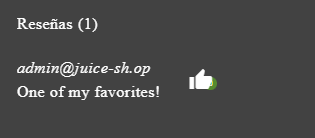

# SEGUNDA SEMANA  
## Retos Improper Input Validation  

---

## • Missing Coding  
**Categorización:** Broken Access Control
**CWE:** 79

- Accedemos a **Photo Wall**, donde vemos la imagen del gato sin cargar.  

- Inspeccionamos la página y buscamos la imagen; observamos la ruta donde debería estar.  

- Si accedemos a la ruta, no hay ninguna imagen que se corresponda con el `src`. 
 
- Copiamos el enlace del `src` para inspeccionarlo. 
 
- Nos damos cuenta de que hay que cambiar las almohadillas `#` por `%23`, ya que HTML no reconoce `#` en la URL. 

- Cargamos la URL correcta y veremos la foto real.  

---

## • Repetitive Registration  
**Categorización:**  Broken Access Control/ Insecure Design
**CWE:**  840/840

- Accedemos al área de registro. 

- Rellenamos los campos.  

- Si después de poner ambas contraseñas cambiamos el campo **Contraseña**, no salta el error de no coincidencia.  
- Al darle a registrarnos, lo acepta. De esta forma se completa el reto.  

---

## • Zero Stars  
**Categorización:**  Broken Access Control
**CWE:**  285

- Accedemos al formulario de **Reseñas**.

- Rellenamos el captcha y el comentario, ya que no deja enviarlo directamente.  

- Vemos que no deja enviarlo, así que inspeccionamos el botón. 
 
- Observamos que el botón tiene el atributo `disabled`.  
- Quitamos el atributo `disabled` y entonces nos dejará enviarlo.  
- Así queda completado el reto.  

---

## • Empty User Registration  
**Categorización:**  Broken Access Control
**CWE:**  306

- Al intentar resolverlo manualmente no se logra (se prueba borrando `required` y modificando el botón).  
- Se revisa la solución.  
- Descargamos **Burp Suite**. 

- Hacemos un POST con los campos rellenados, los vaciamos manualmente en la petición interceptada y enviamos la solicitud.

---

## • Admin Registration  
**Categorización:**  Broken Access Control
**CWE:**  284

- Probamos a ejecutar peticiones POST al backend para ver si se pueden introducir datos manualmente.  
- Abrimos **Postman** y hacemos una petición POST a posibles URLs. 
 
- Descubrimos que se puede hacer a `api/Users`.  
- Al hacer el POST introduciendo los datos, se completa el reto.  

---

## • Mintt The Honey Pot  
**Categorización:**  Broken Access Control
**CWE:**  639

- Se consulta la guía de resolución.  
- Es un reto complejo que requiere registrarse en dos plataformas y trabajar con criptomonedas y NFTs de prueba.  

---

## • Deluxe Fraud  
**Categorización:**  Broken Access Control/ Insecure Design
**CWE:**  840

- Nos dirigimos al apartado **Deluxe Membership** de la web.  
- Con la herramienta **DevTools**, activamos el botón de billetera quitándole dos clases CSS para habilitarlo.  

- Pulsamos continuar y nos dará error.  
- En la pestaña **Network** de DevTools buscamos la petición POST.  
- Editamos la petición en **Burp Suite**, dejando el método de pago vacío, y la reenviamos.  

- Una vez realizado esto, el reto se completa.  

---

## • Payback Time  
**Categorización:**  Broken Access Control
**CWE:**  285

- Añadimos un producto al carrito.  
- En **DevTools → Network**, localizamos el endpoint para modificar el carrito (incluida la cantidad).  
- Copiamos el endpoint de un método PUT y lo usamos en **Postman**.  

- También obtenemos el token **Bearer** desde Network y lo añadimos en la sección Auth de Postman.  

- Probamos una petición añadiendo la ID de un producto (por ejemplo, la 10).  
- Nos devuelve un JSON con los datos y vemos el parámetro `quantity`. 
 
- Hacemos un PUT actualizando `quantity` a un valor negativo, por ejemplo `-100`.  

- Al completar el pedido, aparece que nos deben dinero y se completa el reto.  

---

## • Upload Size  
**Categorización:**  Software and Data Integrity Failures
**CWE:**  434

- La página solo permite archivos de 100 KiB o menos.  
- Usamos **Postman** para hacer un POST al endpoint `/file-upload`.  
- Seleccionamos un PDF de más de 100 KiB.  

- Se envía la petición, devuelve un `204` y se completa el reto.  

---

## • Upload Type  
**Categorización:**  Software and Data Integrity Failures
**CWE:**  434

- Similar al reto anterior.  
- Hacemos un POST desde **Postman** al endpoint `/file-upload`. 
 
- Subimos, por ejemplo, un documento Word.  
- Devuelve un `204` y el reto queda resuelto.  

---