# TERCERA SEMANA  

---

## • Password Strength  
**Clasificación:**  Cryptographic Failures
**CWE:**  521

- Para este reto podemos probar realizando un ataque de fuerza bruta.  
- En algunos productos, el reseñador es el propio admin, lo que nos facilita su correo.  

- Intentamos hacer login con cualquier contraseña interceptando la petición desde **Burp Suite (Proxy)**.  
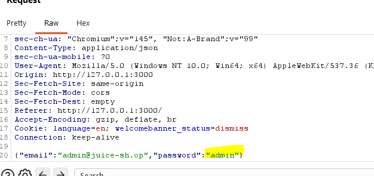
- Enviamos la petición interceptada al módulo **Intruder**, que se encargará de automatizar las solicitudes de fuerza bruta.  
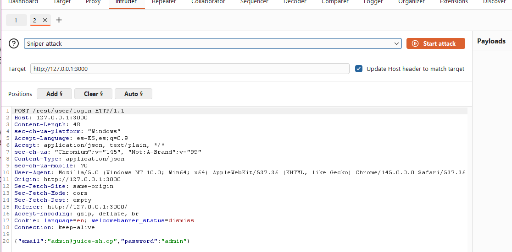
- Descargamos un archivo `.txt` con contraseñas comunes de administrador y lo usamos como diccionario.  
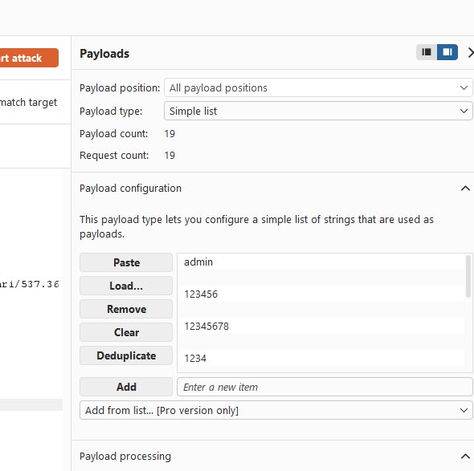
- Observamos que una de las respuestas devuelve un código `200`, lo que indica que la contraseña es correcta.  
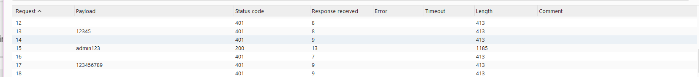
- Iniciamos sesión con esa contraseña y se completa el reto.  

---

## • Bjoern's Favorite Pet  
**Clasificación:**  Injection
**CWE:**  89

- Introducimos el correo `bjoern@juice-sh.op` y pulsamos en “He olvidado la contraseña”.  
- Intentamos buscar información, como que vivía en Uetersen y que había desarrollado un juego.  
- Tras bastante investigación, se consulta la solución.  
- Es necesario decodificar el código postal (CP) de Uetersen y después buscar la unificación de códigos postales.  
- La respuesta correcta resulta ser **West-2082**.  
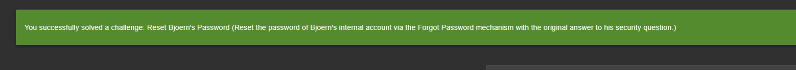

---

## • GDPR Data Erasure  
**Clasificación:**  Insecure Design
**CWE:**  840

- Iniciamos sesión con una cuenta propia e intentamos borrar los datos.  
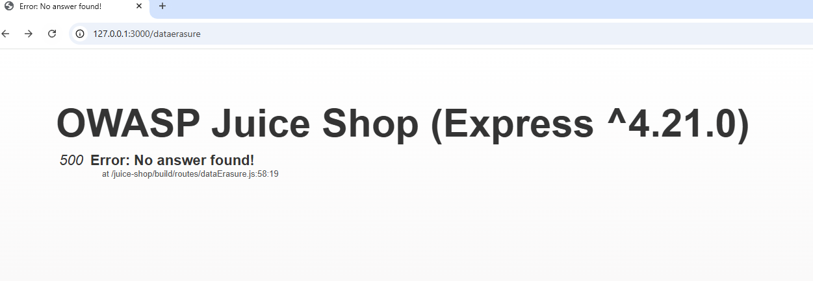
- El servidor devuelve un error `500`.  
- Probamos a iniciar sesión con la inyección:  
- ' or deletedAt IS NOT NULL-- y cualquier contraseña.  
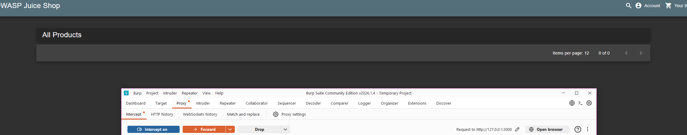
- Se inicia sesión correctamente.  
- Esto confirma el reto. (Para comprenderlo mejor, conviene haber resuelto previamente el reto de credenciales mediante SQL Injection, donde se recuperan datos de usuarios eliminados).  
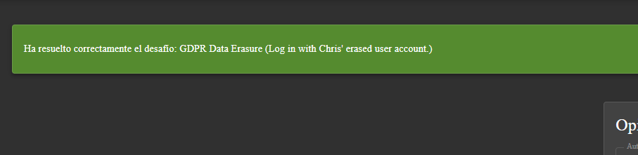

---

## • Reset Jim Password  
**Categorización:**  Cryptographic Failures
**CWE:**  640

- Buscamos el correo de Jim. En la reseña del jugo verde lo podemos encontrar.  
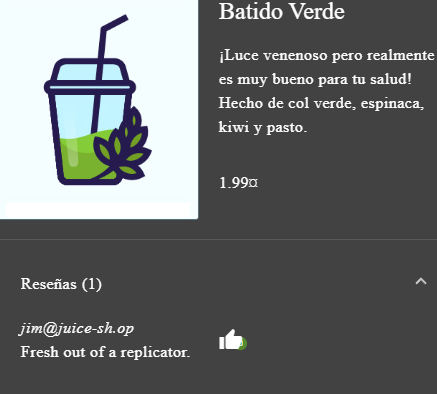
- Intentamos hacer un reset de contraseña para ver su pregunta de seguridad.  
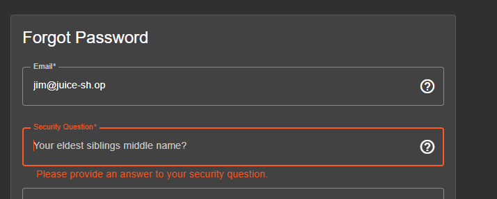
- Investigamos más información en la página.  
- En reseñas encontramos referencias relacionadas con **Enterprise**. 
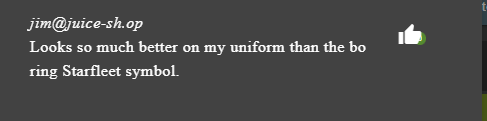 
- Si se tiene cultura de *Star Trek*, puede asociarse al personaje James T. Kirk (Jim).  
- Visitando su Wikipedia, se descubre que tiene un hermano llamado **George Samuel Kirk**.  
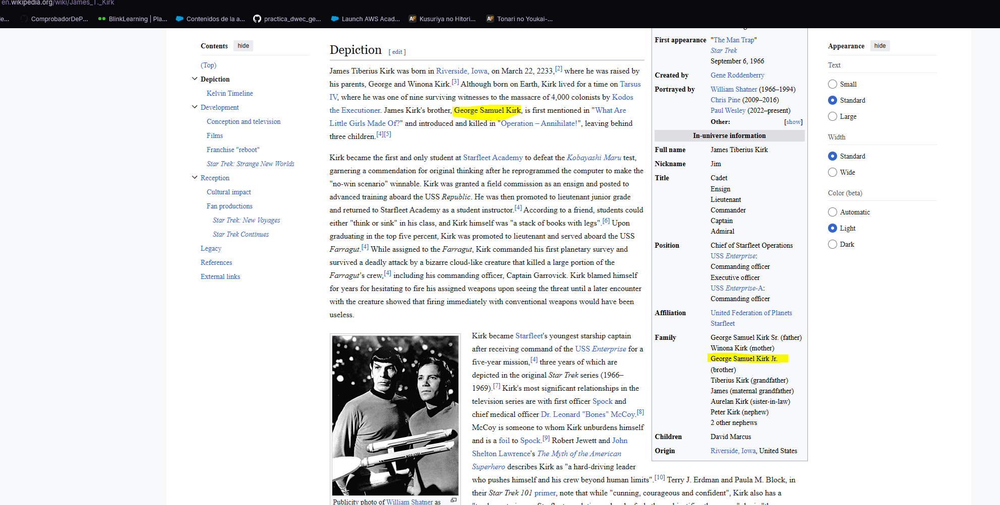
- Probamos con “Samuel”, ya que es el segundo nombre de su hermano mediano.  
- Completamos los campos y el reto se resuelve.  
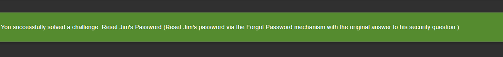

---

## • Login Bjoern  
**Categorización:**  Identification and Authentication Failures
**CWE:**  307

- Como anteriormente logramos iniciar sesión como admin, volvemos a entrar para buscar el correo auténtico de Bjoern.  
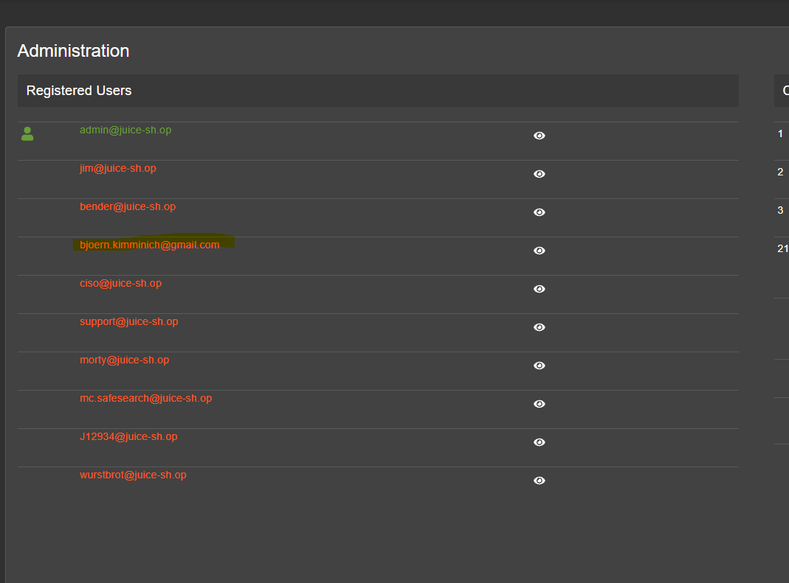
- Con la consola del navegador, hacemos debugging del archivo `main` para buscar alguna función relacionada con OAuth.  
- Observamos que se usa el método `btoa`, que codifica en Base64.  
- Sabiendo esto, realizamos la operación inversa con el correo para obtener la contraseña:  
- Aplicamos `split()`  
- Luego `reverse()`  
- Finalmente `join()`  
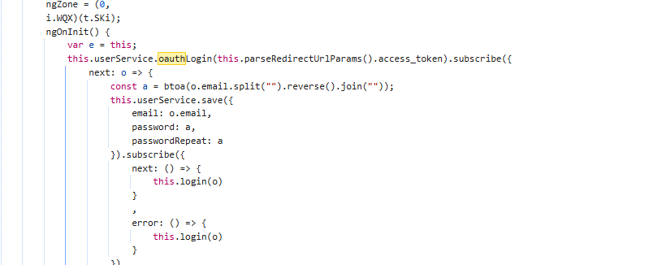
- Después usamos el método `btoa` de `window` para completar la transformación. 
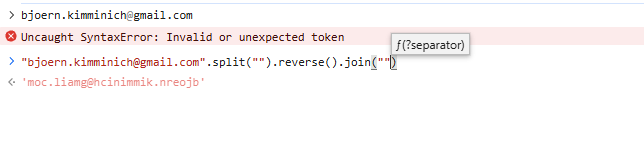 
- Probamos la contraseña generada y se completa el reto.  
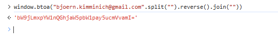 
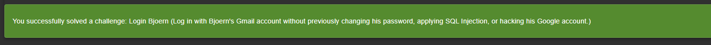 

---